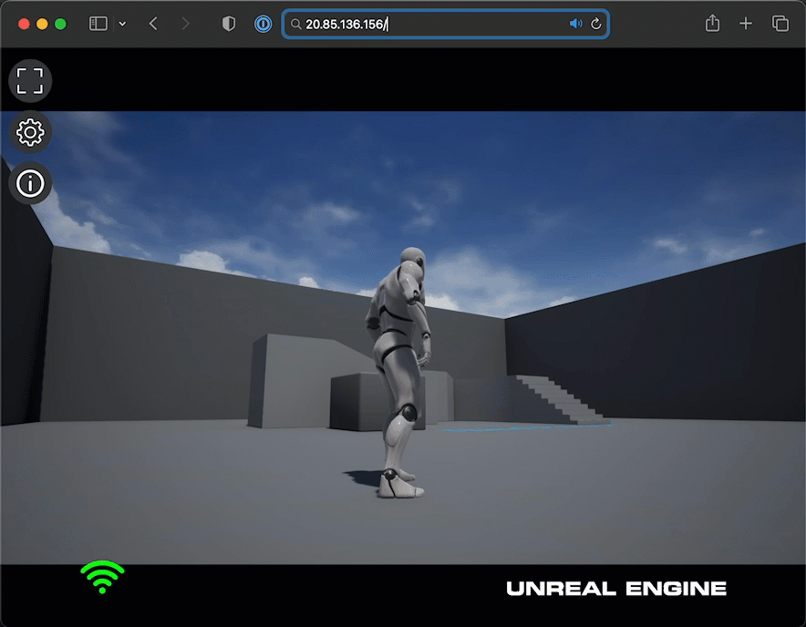
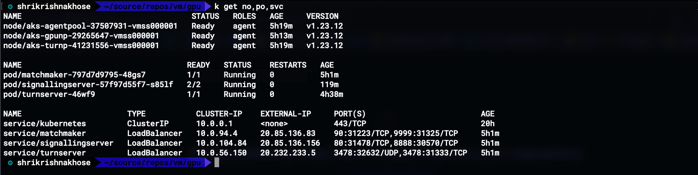
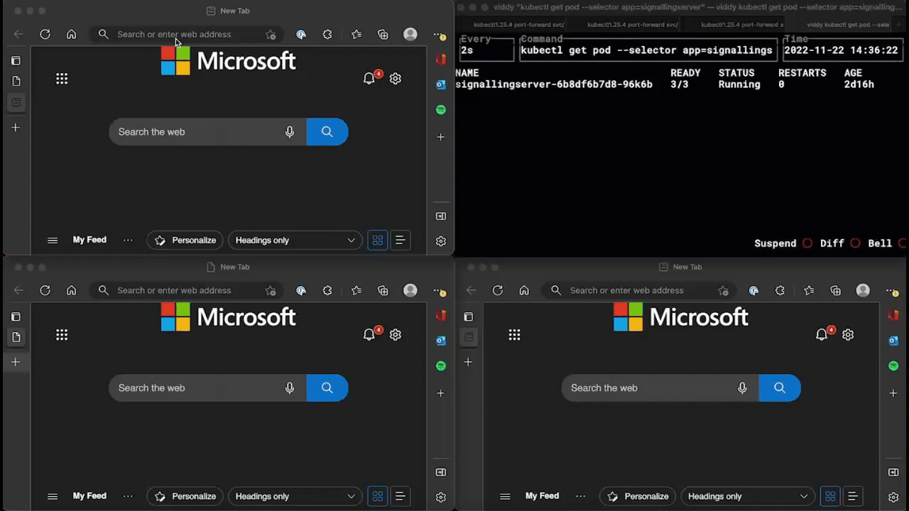

# The Unreal Pixel Streaming On Azure Kubernetes Service!
Referenece Repo to deploy Unreal Pixel Streaming on AKS


## Build and Push Matchmaker,Signalling,TURN and Game Images
``` bash
./docker-build.sh
```
## Provision AKS Service on Azure
```bash
az group create --name pixel_group --location eastus
az aks create -g pixel_group -n uepixelstrm --enable-managed-identity --node-count 1 --enable-addons monitoring --enable-msi-auth-for-monitoring  --generate-ssh-keys

```
### Add a GPU nodepool
```bash
    az aks nodepool add \
    --resource-group pixel_group \
    --cluster-name uepixelstrm \
    --name gpunp \
    --node-count 1 \
    --node-vm-size Standard_NC12_Promo \
    --node-taints sku=gpu:NoSchedule \
    --aks-custom-headers UseGPUDedicatedVHD=true \
    --node-osdisk-size 250 \
    --mode User
    
```    
### Add a nodepool for TURN
```bash
    az aks nodepool add \
    --resource-group pixel_group \
    --cluster-name uepixelstrm \
    --name turnp \
    --node-count 1 \
    --node-vm-size Standard_F8s_v2 \
    --node-taints sku=turn:NoSchedule \
    --node-osdisk-size 250 \
    --mode User \
    --enable-node-public-ip
```
## Deploy Pixel Streaming Services on AKS
```bash 
    kubectl apply -f aks-deploy.yaml
```


# Autoscale Deployment of the Unreal Pixel Streaming On Azure Kubernetes Service!

This is reference implementation for autoscaling of signalling servers based on number of connected players.

## Deploy Redis server to store realtime count of current connected palyers

```bash
kubectl run --image=bitnami/redis:latest --env="ALLOW_EMPTY_PASSWORD=yes" redis
kubectl expose pod redis --port=6379 --target-port=6379
```

## Deploy Autoscaled Pixel Streaming Services on AKS
```bash
 kubectl apply -f aks-deploy-autoscale.yaml
 ```



## Legal
© 2004-2022, Epic Games, Inc. Unreal and its logo are Epic’s trademarks or registered trademarks in the US and elsewhere. 
